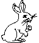

# Il coniglio bianco

Dopo aver letto "Segui il coniglio bianco", Neo sente bussare alla porta. Sono alcuni hacker un po' eccentrici ai quali vende un programma illegale. L'aspetto pallido di Neo, causato da una specie di reclusione autoinflitta, spinge i visitatori a invitarlo a seguirli per una serata in un locale. Neo esita, ma poi decide di seguirli, appena nota che tra loro c’è una ragazza con il tatuaggio di un coniglio bianco sulla spalla. Lungo la strada le chiede dove se lo sia fatto e lei dice che ha trovato un file in un messaggio e le era piaciuto. Il file era questo:



Di nuovo sequenze binarie... La larghezza dell'immagine è di 64 pixel, quindi è possibile convertire ogni riga in un numero intero con segno mettendo a 1 tutti i bit corrispondenti a pixel neri dell'immagine. 

Il primo numero della sequenza è chiaramente 469762048, mentre l'ultimo è 140736414613504.

Arrivati nel locale, Neo viene avvicinato da Trinity, una famosissima hacker, che gli dice: "Zitto, e ascolta. So perché sei qui, Neo. So cosa stai facendo. So perché non dormi. So perché vivi da solo e perché, una notte dietro l'altra, lavori al tuo computer. Tu stai cercando lui. Lo so perché a suo tempo ho cercato la stessa cosa. E quando lui ha trovato me mi ha detto che non cercavo qualcosa di preciso, ma che cercavo una risposta. È la domanda il nostro chiodo fisso, Neo. È la domanda che ti ha spinto fin qui. E tu la conosci, come la conoscevo io."
"Che cos'è Matrix?"
"La risposta è intorno a te, Neo. E ti sta cercando. E presto ti troverà, se tu lo vorrai. Morpheus ti sta cercando. Per incontrarlo puoi fare una serie di scelte positive o negative. Prendi i numeri che ti sono stati consegnati e aumentali o riducili col valore 1234567890123456789 in modo da minimizzare la differenza tra il massimo e il minimo così ottenuti. Questa sarà la chiave."

## Descrizione del problema
Il file di input è un'immagine in formato PNG. Ogni riga fornisce un valore intero con segno a 64 bit ottenuto mettendo a 1 i pixel neri di quella riga, con il pixel più a sinistra che corrisponde al bit più significativo e quello più a destra a quello meno significativo. La sequenza inizia con 469762048 e termina con 140736414613504.

È necessario incrementare o decrementare ogni numero di 1234567890123456789 in modo che la differenza tra il massimo e il minimo così ottenuti sia la più piccola possibile.  

La chiave risultante è una stringa di `+` e `-` che corrisponde alla sequenza di incrementi o decrementi trovati.

## Esempi
Se i valori fossero:
```
9 3 4
```
e il valore con cui modificarli `10`, potremmo provare tutte le combinazioni:
```
---   -1 -7 -6   max-min=6
--+   -1 -7 14   max-min=21
-+-   -1 13 -6   max-min=19
-++   -1 13 14   max-min=21
+--   19 -7 -6   max-min=26
+-+   19 -7 14   max-min=26
++-   19 13 -6   max-min=25
+++   19 13 14   max-min=6
```
Trovando che le soluzioni ottime sono `---` o `+++`.

Con i valori `[9, 1, 2, 10, 3, 6, 8, 1, 9, 1]` e un modificatore di 2, le soluzioni ottime sarebbero `-++-+--+-+` e `-++-++-+-+` con una differenza di 5.

Con i valori forniti da Trinity, c'è una sola soluzione possibile. Trinity sconsiglia di provare tutte le combinazioni. 


